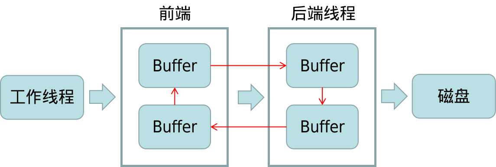
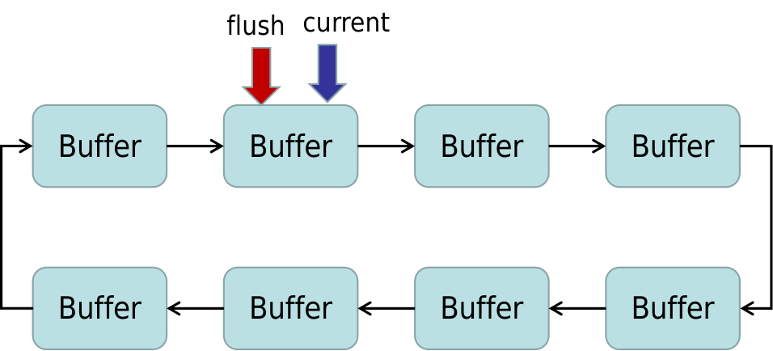
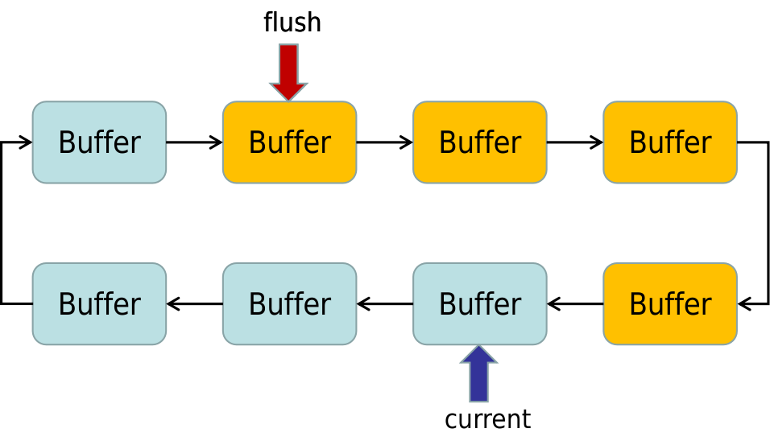
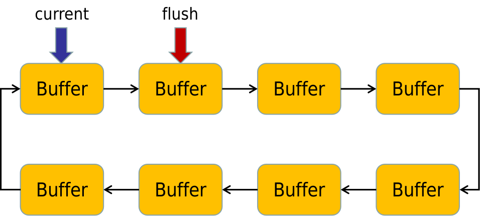
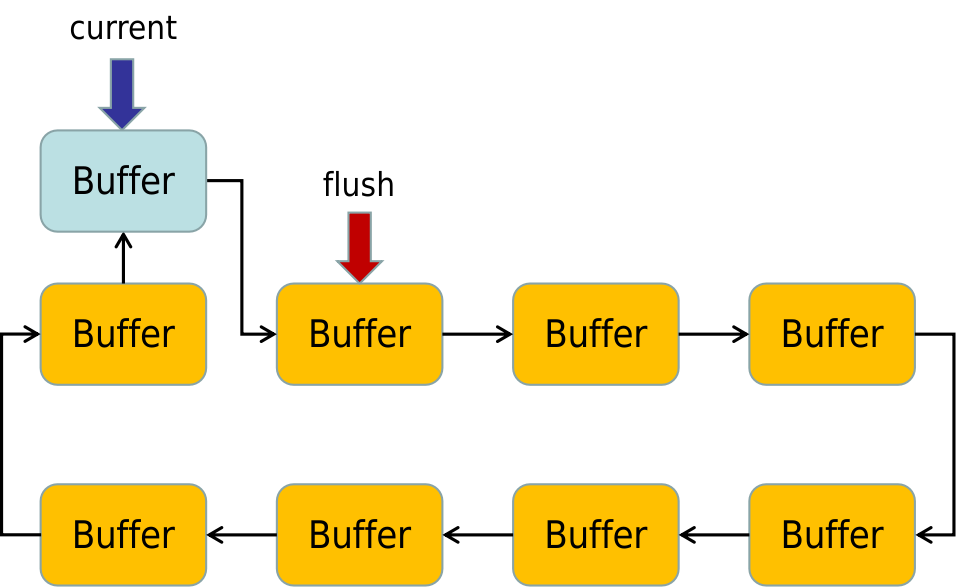

# ZestLogger: High-Performance Logging System

## Introduction

本仓库中包含两个日志系统：普通版(zest)和进阶版(zester)，普通版就是参考陈硕老师《Linux多线程服务端编程》第五章的四缓冲区异步日志，而进阶版将多个缓冲区组织成一个循环链表，可自适应地扩展和收缩缓冲区个数。

本项目使用xmake构建，也可直接用g++手动编译，但比较麻烦。

xmake官网：https://xmake.io/#/

## Environment

+ OS: Ubuntu 20.04
+ Compiler: g++ 9.4.0
+ Additonal: xmake

## Build && Usage (with xmake, recommend)

下载代码仓库

```shell
$ git clone https://github.com/huanggomery/zestLogger.git
```

用xmake构建项目

```shell
$ cd zestLogger
$ xmake
```

构建完项目后，所有可执行文件都在`bin`目录下，包括：

+ zest_single_thread：zest单线程输出测试
+ zest_multi_threads：zest多线程输出测试
+ zester_single_thread：zester单线程输出测试
+ zester_multi_threads：zester多线程输出测试
+ analysis_log：用于分析多线程输出的结果

例如，需要运行zest_single_thread

```shell
$ cd bin
$ ./zest_single_thread
```

输出的日志都在`logs`目录下

## Build && Usage (without xmake)

如果没有xmake，可以直接用g++编译，但是比较麻烦，以zest_single_thread为例，其它同理

```shell
$ git clone https://github.com/huanggomery/zestLogger.git
$ cd zestLogger
$ g++ zest/*.cc zest/testcases/test_single_thread.cc -I . -pthread -o bin/zest_single_thread
```

编译完成后运行：

```shell
$ cd bin
$ ./zest_single_thread
```


## Zest 四缓冲区异步日志

### 核心部分

核心部分就是四个4MB的缓冲区，其中前端两个、后端两个，用户往前端写，前端往后端写，缓冲区满后在前后端之间流动



#### 前端

每个工作线程需要写入日志的时候，就调用前端函数`append(const char *logline, int len)`，该函数主要工作就是向缓冲区写入字符串。前端拥有缓冲区`currentBuffer`和`nextBuffer`，可能遇到的工作情况如下：

1. `currentBuffer`未满，就向其写入（多数情况）
2. `currentBuffer`已满，且`nextBuffer`还没用，则用`nextBuffer`替换`currentBuffer`，然后写入字符串，并通知后端线程（少数情况）
3. `currentBuffer`已满，且`nextBuffer`已经用了，则使用new申请新的缓冲区，写入字符串，并通知后端线程（极少数情况，日志写入特别频率）

#### 后端（线程）

后端线程负责将缓冲区的数据写入硬盘。其工作流程如下：

线程阻塞在一个定时的条件变量上，当线程被唤醒时，可能是以下两种情况：

1. 收到条件变量的通知，即有缓冲区被写满或者线程终止
2. 条件变量的定时器超时，即间歇性强制写入

无论哪种情况，后端线程都负责把已经写满的缓冲区`buffer_`和前端当前正在用的缓冲区`currentBuffer`都写入硬盘。并用后端的两个缓冲区`newBuffer1`和`newBuffer2`替换前端的缓冲区`currentBuffer`和`nextBuffer`，并重新填充`newBuffer1`和`newBuffer2`。

#### 效率与线程安全

前后端所有对`currentBuffer`和`nextBuffer`的操作都用互斥锁进行临界区保护。代码如下：

```c++
// 前端
// AsyncLogging.cpp > append(const char *, int)
locker_.lock();
if (currentBuffer_->avail() >= len)
{
    currentBuffer_->append(logline, len);  // 最多的情况
}
else
{
    buffer_.push_back(std::move(currentBuffer_));
    if (nextBuffer_)
        currentBuffer_.reset(nextBuffer_.release());   // 较少发生
    else
        currentBuffer_.reset(new Buffer);    // 很少发生
    currentBuffer_->append(logline, len);
    cond_.signal();
}

locker_.unlock();
```

```c++
// 后端
// AsyncLogging.cpp > threadFunc()
locker_.lock();

if (buffer_.empty())
    cond_.waitForSeconds(flushInterval_);
buffer_.push_back(std::move(currentBuffer_));
currentBuffer_.reset(newBuffer1.release());
buffersToWrite.swap(buffer_);
if (!nextBuffer_)
    nextBuffer_.reset(newBuffer2.release());

locker_.unlock();
```

临界区内的操作只涉及有限的指针操作，因此效率很高。

### 外部接口

日志系统还包括LogStream和Logging等文件，方便日志系统的使用。

#### LogStream文件

定义了缓冲区`FixedBuffer`模板，维护一个字符串数组`char data[SIZE]`作为实际的缓冲区。

定义了`LogStream`类，里面维护一个4KB的小缓冲区，用于写入单行日志，同时重载了众多<<操作符，使该类的对象能想标准C++输入输出流那样写日志。

#### Logging文件

定义了`Logger`类，这是实际的对外接口，里面包含一个`LogStream`对象。定义了一组宏方便使用：

```c++
// Logging.h
#define LOG_DEBUG Logger(__FILE__, __LINE__, Logger::DEBUG).stream()
#define LOG_INFO Logger(__FILE__, __LINE__).stream()
#define LOG_ERROR Logger(__FILE__, __LINE__, Logger::ERROR).stream()
#define LOG_FATAL Logger(__FILE__, __LINE__, Logger::FATAL).stream()
```

### 工作流程

每当用户使用以下语句时

```c++
LOG_INFO << "something ...";
```

预编译时扩展为

```c++
Logger(__FILE__, __LINE__).stream() << "something ...";
```

即首先构造`Logger`对象，构造函数中会先向流对象写入时间、线程号和日志级别信息，然后继续向流对象写入日志正文。

然后该临时的`Logger`对象马上被析构，执行析构函数。

析构函数会用`pthread_once`创建一个`AsyncLogging`对象，运行后端线程，然后往`AsyncLogging`的前端写入流对象缓冲区中保存的内容。

当后端线程条件变量触发或者超时时，后端线程把数据向硬盘写入。


## Zester 可变缓冲区异步日志

进阶版的Zester日志系统的整体思路和zest一样，都是用户往前端写，前端往后端写，因此只介绍与zest不一样的东西：

+ 缓冲区链表
+ 自适应动态调整缓冲区数目

#### 缓冲区链表

与zest的固定4缓冲区不同，zester将缓冲区组织成一个链表，并维护两个指针：

+ `currentBuffer`

  当前正在使用的缓冲区

+ `nextFlush`

  当前或下一个将要刷盘的缓冲区

在初始时刻，或者日志写入量较少时，两个指针都指向同一个缓冲区，情况是这样：



当快速写入多个缓冲区时，情况是这样：



当缓冲区用完时，`currentBuffer`指向的缓冲区的下一个缓冲区就是`nextFlush`，此时禁止`currentBuffer`向前移动，情况是这样：



#### 自适应动态调整

##### 增加缓冲区

当处于上图所示，缓冲区用完时，需要分配新的缓冲区并插入到`currentBuffer`后面，才能继续移动`currentBuffer`指针，如图所示：



##### 减少缓冲区

当日志写入频率降低时，维持大量的缓冲区太过浪费内存，需要根据写入量，释放空闲的缓冲区。

当所有缓冲区都充分利用时，每次刷盘时`nextFlush`一定是`currentBuffer`的下一个，否则说明有空闲的缓冲区。但是也不能太过“刻薄”，每次刷盘时都释放空闲的缓冲区，这将造成严重抖动，降低日志系统性能。本系统采取的策略是：

1. 判断 `nextFlush` - `currentBuffer` >= 3
2. 如果是，则释放一个缓冲区

该策略对日志流量的变化有一定的宽容度，即两指针相距大于等于3个缓冲区，且变化较平缓。
